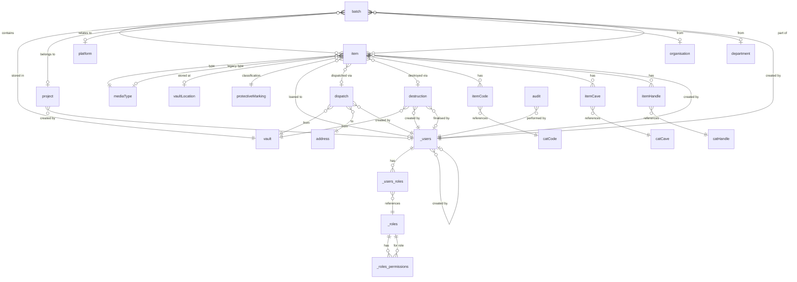

# Database Schema Documentation

This document describes the structure of the RCO2.sqlite database
used by the VAL (Vault Asset Log) application.

## Overview

The database contains **27 tables** and **2 views**, organized into
several functional areas:

- Core business entities (items, batches, projects, dispatch, destruction)
- Reference data (lookups for media types, locations, organizations, etc.)
- Authentication and authorization (users, roles, permissions)
- Audit logging and configuration

## Entity Relationship Diagram



## Core Business Tables

### item

The central table storing media assets (2024+ records in typical
database).

| Column            | Type    | Description                          |
| ----------------- | ------- | ------------------------------------ |
| id                | INTEGER | Primary key                          |
| mediaType         | INTEGER | FK to mediaType - current type       |
| legacyMediaType   | INTEGER | FK to mediaType - original if conv.  |
| startDate         | TEXT    | ISO date - content start date        |
| endDate           | TEXT    | ISO date - content end date          |
| batch             | INTEGER | FK to batch - parent batch           |
| itemNumber        | TEXT    | Item identifier within batch         |
| consecSheets      | TEXT    | Originator ref or sheet count        |
| vaultLocation     | INTEGER | FK to vaultLocation - phys. location |
| remarks           | TEXT    | General notes                        |
| protectiveMarking | INTEGER | FK to protectiveMarking - sec. class |
| protectionString  | TEXT    | Computed protection categories       |
| musterRemarks     | TEXT    | Notes for mustering/inventory        |
| loanedTo          | INTEGER | FK to \_users - user with item loan  |
| loanedDate        | TEXT    | ISO date - when loaned               |
| dispatchJob       | INTEGER | FK to dispatch - dispatch workflow   |
| dispatchedDate    | TEXT    | ISO date - when dispatched           |
| destruction       | INTEGER | FK to destruction - workflow         |
| destructionDate   | TEXT    | ISO date - when destroyed            |
| createdAt         | TEXT    | ISO date - record creation           |
| createdBy         | INTEGER | FK to \_users - creator              |

**Key behaviors:**

- Soft deletes: Items never deleted, only marked with dispatchedDate
  or destructionDate
- Protection categories stored in bridging tables (itemCode,
  itemCave, itemHandle)
- Loan tracking: loanedTo and loanedDate track current loans

### batch

Groups of items received together.

| Column        | Type    | Description                 |
| ------------- | ------- | --------------------------- |
| id            | INTEGER | Primary key                 |
| vault         | TEXT    | FK to vault - storage vault |
| batchNumber   | TEXT    | Batch identifier            |
| yearOfReceipt | INTEGER | Year received               |
| project       | INTEGER | FK to project               |
| platform      | INTEGER | FK to platform              |
| organisation  | TEXT    | FK to organisation          |
| department    | TEXT    | FK to department            |
| remarks       | TEXT    | Notes                       |
| receiptNotes  | TEXT    | Receipt documentation       |
| createdAt     | TEXT    | ISO date - record creation  |
| createdBy     | INTEGER | FK to \_users - creator     |

**Key behaviors:**

- Batch properties (project, platform, etc.) inherited by items via
  richItem view
- Batch numbers are auto-generated by BatchLifeCycle

### project

Project/programme entities (configurable naming via configData).

| Column    | Type    | Description                           |
| --------- | ------- | ------------------------------------- |
| id        | INTEGER | Primary key                           |
| name      | TEXT    | Project name                          |
| startDate | TEXT    | ISO date - project start              |
| endDate   | TEXT    | ISO date - project end                |
| remarks   | TEXT    | Notes                                 |
| enduring  | INTEGER | Boolean - is this an enduring project |
| createdAt | TEXT    | ISO date - record creation            |
| createdBy | INTEGER | FK to \_users - creator               |
| active    | INTEGER | Boolean - available for selection     |

### dispatch

Outgoing item dispatch workflows.

| Column           | Type    | Description                       |
| ---------------- | ------- | --------------------------------- |
| id               | INTEGER | Primary key                       |
| vault            | TEXT    | FK to vault - source vault        |
| name             | TEXT    | Dispatch job name                 |
| createdAt        | TEXT    | ISO date - created                |
| createdBy        | INTEGER | FK to \_users - creator           |
| reportPrintedAt  | TEXT    | ISO date - when report printed    |
| dispatchedAt     | TEXT    | ISO date - when dispatched        |
| toName           | TEXT    | Recipient name                    |
| toAddress        | INTEGER | FK to address - recipient address |
| receiptReceived  | TEXT    | ISO date - receipt confirmation   |
| lastHastenerSent | TEXT    | ISO date - last reminder sent     |
| remarks          | TEXT    | Notes                             |

**Key behaviors:**

- Items reference dispatch via dispatchJob
- Hastener tracking for receipt follow-up

### destruction

Item destruction workflows.

| Column          | Type    | Description                    |
| --------------- | ------- | ------------------------------ |
| id              | INTEGER | Primary key                    |
| vault           | TEXT    | FK to vault                    |
| name            | TEXT    | Destruction job name           |
| createdAt       | TEXT    | ISO date - created             |
| createdBy       | INTEGER | FK to \_users - creator        |
| reportPrintedAt | TEXT    | ISO date - when report printed |
| finalisedAt     | TEXT    | ISO date - when finalised      |
| finalisedBy     | TEXT    | FK to \_users - who finalised  |
| remarks         | TEXT    | Notes                          |

## Bridging Tables

### itemCode, itemCave, itemHandle

Many-to-many relationships between items and protection categories.

| Column                    | Type    | Description                     |
| ------------------------- | ------- | ------------------------------- |
| id                        | INTEGER | Primary key                     |
| item                      | INTEGER | FK to item                      |
| catCode/catCave/catHandle | TEXT    | FK to respective category table |

**Usage:** Each item can have multiple category values. These build
the protectionString field.

## Reference Data Tables

All reference data tables share a common structure with `id`, `name`,
and `active` fields.

### platform

Systems/platforms that items relate to.

| Column | Type    | Description                       |
| ------ | ------- | --------------------------------- |
| id     | INTEGER | Primary key                       |
| name   | TEXT    | Platform name                     |
| active | INTEGER | Boolean - available for selection |

### vaultLocation

Physical storage locations within vaults.

| Column    | Type    | Description          |
| --------- | ------- | -------------------- |
| id        | INTEGER | Primary key          |
| name      | TEXT    | Location identifier  |
| active    | INTEGER | Boolean - available  |
| shelfSize | INTEGER | Capacity of location |

### vault

Vault identifiers (string-based IDs).

| Column | Type    | Description              |
| ------ | ------- | ------------------------ |
| id     | TEXT    | Primary key - vault code |
| name   | TEXT    | Vault name               |
| active | INTEGER | Boolean                  |

### mediaType

Types of media assets.

| Column   | Type    | Description                       |
| -------- | ------- | --------------------------------- |
| id       | INTEGER | Primary key                       |
| name     | TEXT    | Media type name                   |
| active   | INTEGER | Boolean                           |
| itemSize | INTEGER | Size metric for capacity planning |

### protectiveMarking

Security classifications.

| Column | Type    | Description          |
| ------ | ------- | -------------------- |
| id     | INTEGER | Primary key          |
| name   | TEXT    | Classification level |
| active | INTEGER | Boolean              |

### catCode, catHandle, catCave

Protection categories (labels are configurable via configData table).

| Column | Type    | Description                 |
| ------ | ------- | --------------------------- |
| id     | TEXT    | Primary key - category code |
| name   | TEXT    | Category description        |
| active | INTEGER | Boolean                     |

### department, organisation

Organizational units (string-based IDs).

| Column | Type    | Description                  |
| ------ | ------- | ---------------------------- |
| id     | TEXT    | Primary key                  |
| name   | TEXT    | Department/organisation name |
| active | INTEGER | Boolean                      |

### address

Postal addresses for dispatch recipients.

| Column      | Type    | Description             |
| ----------- | ------- | ----------------------- |
| id          | INTEGER | Primary key             |
| createdAt   | TEXT    | ISO date                |
| fullAddress | TEXT    | Complete postal address |
| active      | INTEGER | Boolean                 |
| remarks     | TEXT    | Notes                   |

## Authentication & Authorization

### \_users

User accounts with password management.

| Column          | Type    | Description                     |
| --------------- | ------- | ------------------------------- |
| id              | INTEGER | Primary key                     |
| name            | TEXT    | Full name                       |
| hashed_password | TEXT    | Bcrypt hash                     |
| salt            | TEXT    | Password salt                   |
| username        | TEXT    | Login username                  |
| is_superuser    | INTEGER | Boolean - superuser flag        |
| departedDate    | TEXT    | ISO date - when user left       |
| lastUpdatedAt   | TEXT    | ISO date - last password change |
| createdAt       | TEXT    | ISO date                        |
| createdBy       | INTEGER | FK to \_users (self-reference)  |
| lockoutAttempts | INTEGER | Failed login counter            |
| updateBefore    | TEXT    | ISO date - password expiry      |

**Security features:**

- Passwords expire after 120 days (updateBefore field)
- Account lockout after failed attempts
- Cannot change password more than once per day
- Bcrypt hashing with salt

### \_roles

Three predefined roles.

| Column    | Type     | Description                                   |
| --------- | -------- | --------------------------------------------- |
| id        | INTEGER  | Primary key                                   |
| name      | TEXT     | Role name (default, rco-user, rco-power-user) |
| createdAt | DATETIME | Auto-generated                                |
| updatedAt | DATETIME | Auto-generated                                |

### \_users_roles

User-to-role assignments (many-to-many).

| Column    | Type     | Description    |
| --------- | -------- | -------------- |
| id        | INTEGER  | Primary key    |
| user_id   | INTEGER  | FK to \_users  |
| role_id   | INTEGER  | FK to \_roles  |
| createdAt | DATETIME | Auto-generated |
| updatedAt | DATETIME | Auto-generated |

### \_roles_permissions

Permission matrix for role-based access control.

| Column     | Type     | Description         |
| ---------- | -------- | ------------------- |
| id         | INTEGER  | Primary key         |
| role_id    | INTEGER  | FK to \_roles       |
| table_name | TEXT     | Resource/table name |
| create     | BOOLEAN  | Can create records  |
| read       | BOOLEAN  | Can read records    |
| update     | BOOLEAN  | Can update records  |
| delete     | BOOLEAN  | Can delete records  |
| createdAt  | DATETIME | Auto-generated      |
| updatedAt  | DATETIME | Auto-generated      |

**Constraint:** UNIQUE(role_id, table_name)

### \_revoked_refresh_tokens

Token blacklist for authentication.

| Column        | Type     | Description          |
| ------------- | -------- | -------------------- |
| id            | INTEGER  | Primary key          |
| refresh_token | TEXT     | Revoked token value  |
| expires_at    | NUMERIC  | Expiration timestamp |
| createdAt     | DATETIME | Auto-generated       |
| updatedAt     | DATETIME | Auto-generated       |

## Audit & Configuration

### audit

Comprehensive audit log for all operations.

| Column          | Type    | Description                          |
| --------------- | ------- | ------------------------------------ |
| id              | INTEGER | Primary key                          |
| user            | INTEGER | FK to \_users - who performed action |
| resource        | TEXT    | Resource/table name                  |
| dataId          | INTEGER | ID of affected record                |
| activityType    | INTEGER | Type code (see activity-types.ts)    |
| dateTime        | TEXT    | ISO timestamp                        |
| label           | TEXT    | Human-readable activity description  |
| activityDetail  | TEXT    | JSON or text details                 |
| securityRelated | INTEGER | Boolean - flag for security review   |
| subjectId       | INTEGER | Related entity ID                    |
| subjectResource | TEXT    | Related entity type                  |
| ip              | TEXT    | Client IP address                    |

**Key activities logged:**

- LOGIN, LOGOUT
- CREATE, UPDATE, DELETE operations
- LOAN, RETURN (item loans)
- DISPATCH, DESTRUCTION workflows
- PASSWORD_CHANGE
- MUSTER operations

### configData

Instance configuration (single row).

| Column         | Type | Description                         |
| -------------- | ---- | ----------------------------------- |
| projectName    | TEXT | Singular label for projects         |
| projectsName   | TEXT | Plural label for projects           |
| fromAddress    | TEXT | Default sender address for dispatch |
| protectionName | TEXT | Label for protection section        |
| catCode        | TEXT | Label for catCode category          |
| catHandle      | TEXT | Label for catHandle category        |
| catCave        | TEXT | Label for catCave category          |
| headerMarking  | TEXT | Header/footer text for reports      |
| reportPrefix   | TEXT | Prefix for report reference numbers |

**Usage:** Allows customization of terminology without code changes.

## Views

### richItem

Denormalized view joining item data with batch properties.

```sql
SELECT
  i.*,
  b.project,
  b.platform,
  b.vault,
  b.department
FROM item i
INNER JOIN batch b ON i.batch = b.id
```

**Purpose:** Provides efficient access to item data with inherited
batch properties. Used by frontend for most item queries.

### loanUsers

Aggregates loan statistics per user.

```sql
SELECT
  i.loanedTo as id,
  COUNT(i.id) as numItems,
  u.username
FROM item i
INNER JOIN "_users" u ON i.loanedTo = u.id
GROUP BY u.name, i.loanedTo
```

**Purpose:** Quick lookup of how many items each user has on loan.

## Design Patterns & Conventions

### Soft Deletes

The database does **not support hard deletes** for core business
entities (items, batches, projects, etc.). Instead:

- Items are marked with `dispatchedDate` or `destructionDate`
- Reference data uses `active = 0` to hide deprecated values
- Only bridging tables (itemCode, itemCave, itemHandle) support
  DELETE operations

### Audit Trail

All business tables include:

- `createdAt` - ISO 8601 datetime string
- `createdBy` - FK to \_users

All CRUD operations are logged to the `audit` table with:

- User who performed the action
- Timestamp
- Resource and record ID
- Activity type and details

### Data Types

- **Dates**: TEXT columns storing ISO 8601 format (YYYY-MM-DD or
  YYYY-MM-DDTHH:MM:SS)
- **Booleans**: INTEGER (0 = false, 1 = true)
- **IDs**: INTEGER with AUTOINCREMENT (except vault, department,
  organisation, catCode/Cave/Handle which use TEXT)

### Referential Integrity

Foreign key constraints are defined for all relationships. The
soul-cli backend enforces these constraints.

### Active Flags

Reference data tables use `active` boolean to:

- Hide deprecated values from dropdowns in create forms
- Keep values visible in edit forms for existing records
- Preserve referential integrity without hard deletes

## Common Queries

### Find all live items (not dispatched/destroyed)

```sql
SELECT * FROM richItem
WHERE dispatchedDate IS NULL
  AND destructionDate IS NULL
```

### Items on loan

```sql
SELECT * FROM item
WHERE loanedTo IS NOT NULL
```

### Audit trail for specific item

```sql
SELECT * FROM audit
WHERE resource = 'item'
  AND dataId = ?
ORDER BY dateTime DESC
```

### User permissions

```sql
SELECT rp.table_name, rp.create, rp.read, rp.update, rp.delete
FROM _users_roles ur
JOIN _roles_permissions rp ON ur.role_id = rp.role_id
WHERE ur.user_id = ?
```

## Database Maintenance

### Backup

```bash
sqlite3 db/RCO2.sqlite ".backup db/RCO2-backup-$(date +%Y%m%d).sqlite"
```

### Schema Export

```bash
sqlite3 db/RCO2.sqlite ".schema" > db/schema.sql
```

### Vacuum

```bash
sqlite3 db/RCO2.sqlite "VACUUM;"
```

## Migration Strategy

Schema changes should:

1. Be made to the SQLite file directly using a database tool
2. Update TypeScript types in `src/types.d.ts`
3. Update lifecycle callbacks if business logic changes
4. Increment `VITE_DATA_VERSION` in `.env` to trigger data reload
5. Document changes in this README
