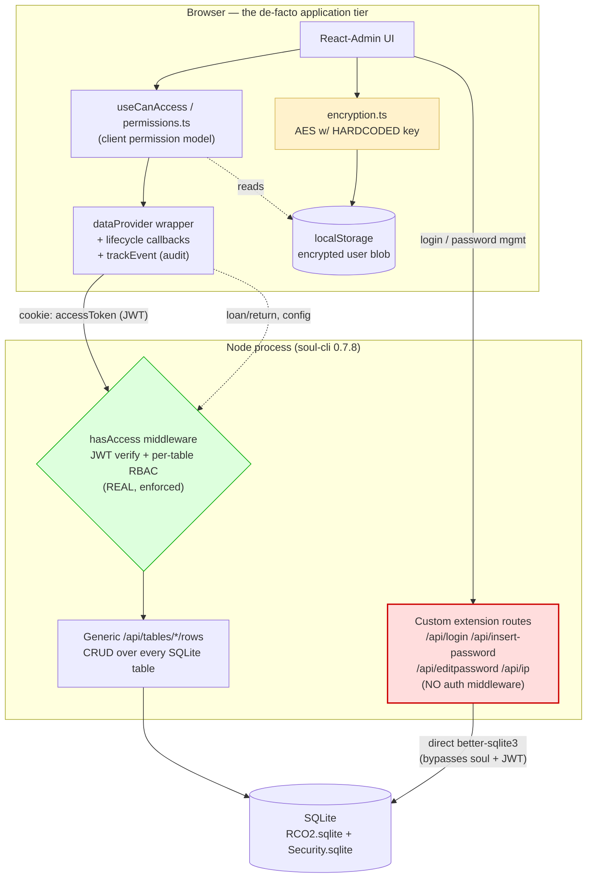
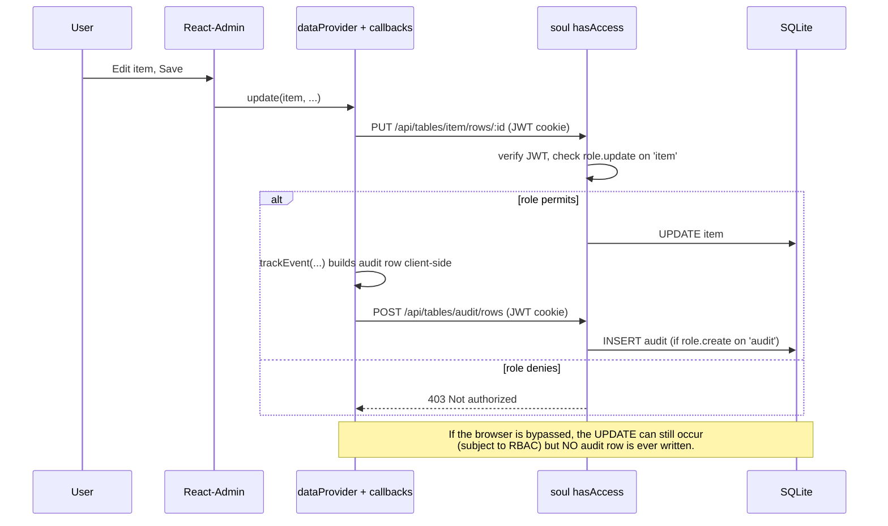
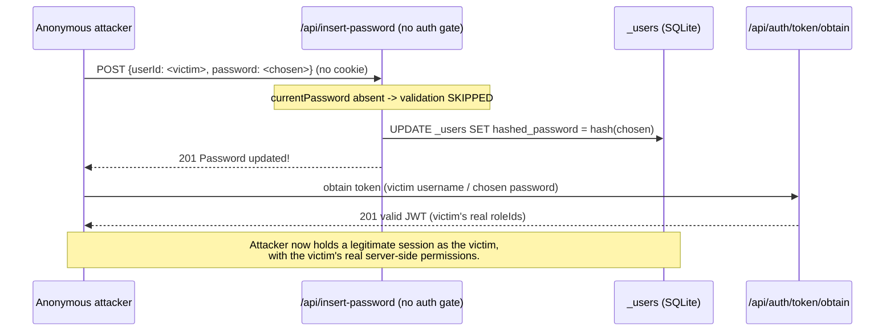

# VAL/RCO — Architecture & Tech-Debt Audit

> **Scope.** Adversarial health-check of the VAL (Vault Asset Log / RCO) secure
> asset register across four dimensions: architecture & boundaries, security
> posture, code quality & consistency, and testing & deployability.
> **Method.** Every claim in `CLAUDE.md`/`README.md` was treated as a hypothesis
> to falsify against source. The security hypotheses were then **live-probed**:
> `soul-cli@0.7.8` was booted against a throwaway copy of `db/RCO2.sqlite` with
> the real `_devExtensions` mounted, and the attacks below were executed over
> HTTP. Findings are tagged **[VERIFIED]** (proven in code and/or live),
> **[SUSPECTED]** (strong code evidence, not executed), or **[DISPROVED]**
> (a plausible concern that testing refuted).
>
> Findings anchor to `file:line`. The production database was never touched.

---

## 1. Executive summary

VAL is a React-Admin front end over **soul-cli**, a generic "SQLite → REST"
server, with a thin layer of custom Express endpoints for authentication and
password management. The architecture's defining characteristic is that **almost
all domain logic — audit logging, reference-number generation, permission
shaping — lives in the browser**, while the server is a largely generic table
API plus a handful of hand-written auth routes.

The single most important result of this audit is a correction that only live
probing could produce: **soul-cli _does_ enforce authentication and per-table,
per-verb authorization on `/api/tables/*`.** A read-only review would reasonably
conclude the opposite (the app ships its own client-side permission system and a
client-side "deletion not supported" guard), but the server-side RBAC is real
and was confirmed with 401/403 responses. The genuine critical exposure is not
the table API — it is the **custom extension routes, which soul mounts with no
authentication middleware at all.**

### Top risks, ranked

| # | Severity | Finding | Status |
|---|----------|---------|--------|
| 1 | **Critical** | Unauthenticated account takeover: `POST /api/insert-password` resets any user's password with no token and no `currentPassword` | [VERIFIED] live |
| 2 | **Critical** | SQL injection in `insertPasswordRecord` — `userId` is string-interpolated into an `INSERT` | [VERIFIED] live |
| 3 | **High** | Client "encryption" key is hardcoded in source; localStorage user blob (roles/`is_superuser`) is user-forgeable — unlocks the full **UI** | [VERIFIED] |
| 4 | **High** | `.env` is tracked in git with a placeholder `TOKEN_SECRET`; a weak/known JWT secret makes all tokens (and `roleIds`) forgeable server-side | [VERIFIED] |
| 5 | **High** | Audit trail is client-generated, best-effort, and incomplete; whole classes of mutations are never logged, and audit-write failures are swallowed | [VERIFIED] |
| 6 | **Medium** | Two parallel permission models (client UI vs server RBAC) that can silently drift; the client model has a real shape bug in `mapPermissions` | [VERIFIED] |
| 7 | **Medium** | `/api/ip` reflects a spoofable `X-Forwarded-For`, which is then stored as the audit `ip` | [VERIFIED] live |
| 8 | **Medium** | Deployability: no DB migration tooling, ABI-locked native module shipped whole, CI never runs the linter, build-baked `VITE_DATA_VERSION` | [VERIFIED] |
| 9 | **Low/Med** | No role has `delete` on any table — the client's bridging-table delete path returns 403 for every non-superuser | [VERIFIED] live |

### What the adversarial + live method changed

Three conclusions a static-only pass would likely have gotten **wrong**:

- **"Authorization isn't enforced on the server."** *Disproved.* soul's
  `hasAccess` middleware verifies the JWT and checks `_roles_permissions`
  per-table/per-verb. Live: unauth read → **401**; non-superuser `DELETE item`
  → **403**.
- **"An attacker can rewrite or delete audit rows via the API."** *Disproved*
  for non-superusers — `audit` is `update=0/delete=0` for every role; live
  `PUT`/`DELETE` on `audit` → **403**. Audit is effectively append-only unless
  you already hold a superuser token.
- **"A low-priv user escalates to full data access by forging localStorage."**
  *Refined.* Forgery unlocks the **UI** only; the server still governs data via
  the httpOnly JWT, so real access never exceeds the user's true role. Direct
  `_users` writes of `is_superuser`/`hashed_password` are stripped by soul
  middleware (live → **400 "No fields provided"**).

---

## 2. Architecture map (as-built)



**Trust-boundary reading.** The green box (`hasAccess`) is a real server-side
gate. The red box (extension routes) is the hole: `setupExtensions`
(`soul-cli/src/extensions.js`) registers each extension with a bare
`app.post(api.path, api.handler)` — **no `hasAccess`, no JWT check** — and those
handlers open the SQLite files directly with `better-sqlite3`, sidestepping both
soul's RBAC and its `_users` field-stripping.

### Request lifecycle (sanctioned path, with client-side audit)



The key structural weakness visible here: **the mutation and its audit record
are two independent client-initiated calls.** Nothing on the server ties them
together, so audit is advisory (see §4.3).

---

## 3. Security posture

### 3.1 [VERIFIED — Critical] Unauthenticated account takeover via `/api/insert-password`

`insertPasswordRecord` (`_devExtensions/api.js:67-139`) is mounted by soul with
no auth middleware, and its own logic only validates the caller's current
password **if `currentPassword` is present**:

```js
if (currentPassword !== undefined) {        // _devExtensions/api.js:87
  validateCurrentPassword(mainDb, userId, currentPassword)
}
```

Omit `currentPassword` and the check is skipped entirely; the handler then hashes
the supplied `password` and writes it to `_users.hashed_password` for the given
`userId` (`updateUserPassword`, `api.js:57-65,123`). There is no
`authenticateRequest` call anywhere in this handler (contrast
`editPassword-controller.js:32`, which does authenticate).

**Live proof** (soul + real `_devExtensions`, throwaway DB):

```
POST /api/insert-password   body {"fields":{"userId":2,"password":"Attacker#Pass99"}}
  (no cookie, no currentPassword)              -> HTTP 201 {"message":"Password updated!"}
POST /api/auth/token/obtain STAFF-1 / Attacker#Pass99  -> HTTP 201 {"data":{"userId":2}}
```

Any anonymous network client that can reach the server can set any user's
password and then log in as them — including power users. **This is the highest-
severity issue in the codebase.**

**Fix.** Gate every state-changing extension route behind `authenticateRequest`
(as the password-edit controller already does), require `currentPassword` for
self-service and a power-user role for administrative resets, and treat
"`currentPassword` absent" as a hard failure rather than a skip.

### 3.2 [VERIFIED — Critical] SQL injection in `insertPasswordRecord`

The same handler builds its `INSERT` by string-concatenating values
(`api.js:103-119`):

```js
const valuesString = Object.values(fields)
  .map((value) => (typeof value === 'string' ? `'${value}'` : value))
  .join(', ')
const query = `INSERT INTO passwords ${'(' + fieldsString + ') VALUES (' + valuesString + ')'}`
securityDb.prepare(query).run()
```

`userId` comes straight from the request body. Every other write in the auth
layer uses parameterized queries (`?` placeholders) — this one does not.

**Live proof.** Sending `userId = "1'),('inj-proof-marker"` produced
`SQLITE_ERROR: all VALUES must have the same number of terms` — the payload
escaped the string literal and altered the SQL's structure. A count-matched
payload would insert or manipulate rows at will.

**Fix.** Use a parameterized prepared statement (`INSERT INTO passwords (...)
VALUES (?, ?, ?)`), matching the rest of the module.

### 3.3 [VERIFIED — High] Client "encryption" is obfuscation; UI permissions are forgeable

`encryption.ts:2-3` hardcodes the AES key, and `vite.config.ts:14` sets
`VITE_KEY` to `null`, so the fallback literal always ships — and would be inlined
into the bundle even if set. `getPermissions()` (`authProvider/index.ts`) derives
the entire permission object from the AES-decrypted localStorage blob, branching
on `user.is_superuser`. A user who decrypts, flips `is_superuser`/`userRole`, and
re-encrypts unlocks the full admin **UI**.

**Boundary that saves it (live-confirmed).** Real data access is governed by the
httpOnly JWT, not localStorage. Forging the blob does **not** grant server access
beyond the user's true role, and soul strips `is_superuser`/`hashed_password`
from direct `_users` writes (`middlewares/api.js`; live `PUT _users` →
`400 "No fields provided"`). So this is a **UI-integrity / information-disclosure**
issue (a low-priv user can render screens they shouldn't see, and read anything
their role can read), not by itself a data-tampering escalation. The same
workflow key literal is also committed in `.github/workflows/static.yml`.

### 3.4 [VERIFIED — High] `.env` tracked with placeholder `TOKEN_SECRET`

`.env` is committed (it is not in `.gitignore`) with
`TOKEN_SECRET=Add_Your_Token_Secret_Here`. `auth-helper.js:17` and soul both sign
and verify JWTs with this secret. If an operator ships or keeps the placeholder,
the JWT HMAC secret is public — and because `roleIds`/`isSuperuser` live *inside*
the JWT, a known secret makes server-side authorization forgeable too, which
would collapse the very RBAC that otherwise holds (§3.6). Stop tracking `.env`;
ship `.env.example` instead and fail fast on a placeholder secret at boot.

### 3.5 [VERIFIED — Medium] `/api/ip` reflects a spoofable header into the audit trail

`getIp` (`_extensions/api.js:10-16`, `_devExtensions/api.js:10-16`) returns
`req.headers['x-forwarded-for']` verbatim. The client caches this and stores it
as the audit `ip` (`utils/audit.ts`, `utils/helper.ts`). **Live:**
`GET /api/ip` with `X-Forwarded-For: 66.66.66.66-SPOOFED` → `{"ip":"66.66.66.66-SPOOFED"}`.
Audit IPs are attacker-controlled and cannot be trusted for forensics.

### 3.6 [DISPROVED / refined] Server-side authorization *is* enforced

Contrary to what the client-only permission code implies, soul's `hasAccess`
(`soul-cli/src/middlewares/auth.js`) is wired onto every row route
(`routes/rows.js`): it verifies the JWT, short-circuits for superusers, and
otherwise checks `_roles_permissions` for the table and HTTP verb. The seeded
matrix gives `rco-user`/`rco-power-user` CRU (no D) on operational tables and
**`create/read` only on `audit`** (no update/delete) — **no role has `delete`
on any table.**

**Live matrix (non-superuser token):**

| Request | Result |
|---|---|
| `GET item/rows` unauthenticated | **401** |
| `GET item/rows` authenticated | 200 |
| `DELETE item/rows/1` | **403 Not authorized** |
| `DELETE audit/rows/1` | **403** |
| `PUT audit/rows/1` | **403** |
| `POST audit/rows` (create) | allowed by RBAC (blocked only by FK/NOT NULL) |
| `PUT _users` with `is_superuser`/`hashed_password` | **400** (fields stripped) |

**Consequence worth noting (§3.9):** because `delete=0` for every role, the
client data provider's bridging-table delete path
(`dataProvider/index.ts:351-371`) will return **403** for any non-superuser —
a latent functional bug, not just a security nuance.

### 3.7 [VERIFIED — Medium] Two permission models that can drift

Authorization is defined **twice**: once in the client
(`authProvider/permissions.ts`) to shape the UI, and once in the server
(`_roles_permissions` + `hasAccess`) to enforce access. They are maintained
independently and can diverge — a role granted UI access it lacks server-side
yields broken screens; the reverse yields data reachable by API but invisible in
the UI. The client model additionally has a **shape bug**: `mapPermissions`
builds `{read, write, delete}` booleans in one branch but writes raw DB fields
`{read, create, update, delete}` for `R_ALL_ITEMS` in another, and `canAccess`
compares against both shapes. Untested (§5).

### 3.8 Attack path summary



### 3.9 Other security-relevant notes

- **[VERIFIED]** `login-controller.js:72` opens a `better-sqlite3` handle per
  login attempt and never closes it (no `finally`), unlike the edit-password
  controller — a handle leak under load.
- **[VERIFIED]** Failed logins / lockout increments (`login-controller.js:53-58`)
  write no audit; LOGIN/LOGOUT audits are client-side only, so direct
  `/api/login` use and all failed attempts are invisible.
- **[VERIFIED]** The 120-day password-expiry and 1-hour idle-timeout are
  client-only (`App.tsx`); the server issues tokens regardless. Password
  *complexity* and *lockout/departed/forced-update*, by contrast, are real
  server controls (`password-validation.schema.js`, `login-controller.js`).

---

## 4. Audit-trail integrity

### 4.1 [VERIFIED] Generated client-side, tied to nothing server-side

`trackEvent` (`utils/audit.ts:15-46`) builds the row in JS and writes it via the
ordinary `dataProvider.create(R_AUDIT, ...)`. No server extension writes audit
rows. The mutation and its audit entry are separate calls; bypass the client and
the mutation (if RBAC permits) happens with **no** audit.

### 4.2 [VERIFIED / refined] Forgeable, but constrained; tamper-resistant for non-superusers

Every attribution field is client-supplied: `user` from the decrypted
localStorage blob, `dateTime` from the client clock, `ip` from the spoofable
`/api/ip` (§3.5). So an authenticated user can **insert** misattributed,
back-dated audit rows. **But** live testing shows two real limits: the `audit`
table has a **foreign key on `user`** (forged `user:9999` → `400 FOREIGN KEY
constraint failed`), so misattribution is limited to *existing* user ids; and
non-superusers cannot **update or delete** existing rows (`403`). Existing
history is effectively append-only unless an attacker already holds a superuser
token (superusers bypass `hasAccess` and could tamper — with no meta-audit).

### 4.3 [VERIFIED] Incomplete: whole classes of mutations are never logged

- User edits (role/username/departedDate/unlock): `UserLifeCycle.ts` overrides
  `beforeUpdate` without `auditForUpdatedChanges` — no audit.
- Destruction edits: `DestructionLifeCycle.ts` is hand-rolled, no update audit.
- All `updateMany`/bulk operations, including loan/return field writes
  (`LoanCustomMethods.ts`) — no per-record diff audit.
- Bridging-table deletes (protective codes/caveats/handling,
  `dataProvider/index.ts:351-371`) — no audit call at all.
- Server-side password changes (`insert-password`, `editpassword`) — no audit.
- The reference-number "second update" that Item/Batch/Dispatch/Destruction each
  perform post-create — silently unaudited.

### 4.4 [VERIFIED] Failures are swallowed

`UserLifeCycle.ts:49` does `audit(auditObj).catch(console.log)` — a
security-related ("Password assigned") audit write can fail while the user update
persists. More broadly, `trackEvent` no-ops when `getUser()` is undefined
(`audit.ts:27`): an expired/cleared token means the mutation proceeds and no
audit is written, with no error surfaced.

---

## 5. Code quality & testing

**Types.** `tsconfig.json` sets `strict: true`, yet there are **111 `any`**
occurrences in non-test `src/`; the worst is `dataProvider/index.ts` (17), whose
public surface is cast `as CustomDataProvider & DataProvider`, erasing type
safety at the boundary. Non-null assertions: none (clean). One
`@ts-expect-error` (`dataprovider-utils.ts:76`); six `eslint-disable`.

**Duplication + a latent bug.** The boolean-coercion and operator-mapping logic
is copy-pasted between `getList` (`index.ts:115-158`) and `getManyReference`
(`:234-257`) and has drifted — and the two build URLs differently: `getList`
uses `queryString.stringify` (correct) while `getManyReference:267` uses
`` `?${JSON.stringify(query)}` ``, producing a malformed query string. **[SUSPECTED]** bug.

**Error handling.** ~36 `.catch(console.log)` sites in non-test `src/`, including
permission load (`useCanAccess.ts:22`) and audit (§4.4). Failures are invisible
to users and to any monitoring.

**Dead code.** `editPassword-controller.js:57` hashes into `newPassword` that is
never used (line 59 passes the plaintext on to be re-hashed). Commented-out
blocks in `components/Layout/index.tsx:63-88`, `resources/platforms/index.tsx`,
`utils/generateData.ts`, and others.

**Tests — the security spine is untested.** Six test files total (~1,340 lines
unit + one 100-line e2e). Well covered: batch-number generation and item/dispatch/
destruction *operation helpers* (including the 69-item pagination regression),
and the login password-bypass regression. **Not covered:** `permissions.ts`
(`canAccess`/`mapPermissions`), `authProvider`, `auth-helper.js` (JWT + role
gate), `editPassword`/`updateBefore` controllers, `trackEvent`, and six of eight
lifecycle callbacks. The dispatch/destruction/item tests exercise standalone
helpers, **not** the lifecycle hooks registered in `index.ts`. e2e is login-only
and has reliability smells (deprecated `.type()`, `waitForLoadState` races,
absence-assertions on snackbars, hardcoded seeded creds).

---

## 6. Deployability

- **[VERIFIED] No migration tooling.** `CLAUDE.md` says "manually apply SQL
  migrations." There is no migrations directory and no schema versioning; target
  DB schema can silently diverge from what the code expects.
- **[VERIFIED] ABI-locked native module shipped whole.** `better-sqlite3` is a
  native addon; the air-gapped flow copies `node_modules/` entirely. This breaks
  unless the target's OS **and** Node ABI match the build machine. (This audit hit
  exactly that wall: the pinned `better-sqlite3@8` would not compile under Node 22
  and had to be run under Node 20 with a prebuilt binary.) `CLAUDE.md` notes the
  OS requirement but not the Node-ABI one.
- **[VERIFIED] `VITE_DATA_VERSION` is build-baked and mock-only.** Vite inlines
  `VITE_*` at build time, so editing the target `.env` after `yarn build` has no
  effect; the mechanism only regenerates mock/LocalForage data
  (`App.tsx`), irrelevant to the production soul/SQLite backend.
- **[VERIFIED] CI does not lint.** `.github/workflows/node_compile.yml` runs
  `yarn build` + `yarn test` but **no `yarn lint`**, despite lint being
  `--max-warnings=0`. `tsc` runs inside `build`, so type errors are caught;
  ESLint violations are enforced only by a locally bypassable pre-commit hook.
- **[VERIFIED] Doc drift.** `README.md:48` tells operators to run
  `yarn serve:soul`, which does not exist (only `serve`/`serve:dev`/`serve:large`).

---

## 7. Prioritized remediation

**Do now (Critical).**
1. Add `authenticateRequest` + role/`currentPassword` checks to
   `insert-password` (and audit every extension route); treat missing
   `currentPassword` as failure, not skip. (§3.1)
2. Parameterize the `passwords` `INSERT`. (§3.2)

**Do next (High).**
3. Stop tracking `.env`; ship `.env.example`; refuse to boot on a placeholder
   `TOKEN_SECRET`; rotate the committed workflow key. (§3.3, §3.4)
4. Make audit server-authoritative for the operations that matter (server-set
   `user`/`dateTime`/`ip`; write audit inside the same server path as the
   mutation) and stop swallowing audit failures. (§4)

**Do soon (Medium).**
5. Collapse to a single source of truth for permissions — derive the UI from the
   server's `_roles_permissions`, not from client-held state; fix the
   `mapPermissions` shape bug; add tests. (§3.6, §3.7, §5)
6. Fix the `getManyReference` URL construction; de-duplicate the filter-transform
   logic. (§5)
7. Reconcile the `delete=0`-for-all-roles matrix with the client's bridging-table
   delete path. (§3.6/§3.9)
8. Add `yarn lint` to CI; introduce migration tooling / schema versioning;
   document the Node-ABI constraint; fix the `README` `serve:soul` reference. (§6)

---

*Appendix — reproduction.* soul-cli 0.7.8 was booted as
`soul -d db/RCO2.sqlite --e _devExtensions --a --env=.env --p 8799` against a
**copy** of the production database. The takeover, SQLi, RBAC matrix, and
IP-spoofing results in §3–§4 are live HTTP responses from that instance.
